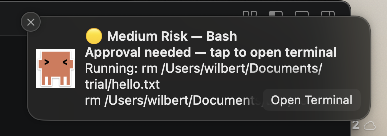

# Claude Alert

Never miss a Claude Code approval prompt.



---

## Install

### Tier 1 — Quick Install (Recommended)

No Xcode required. Works on any Mac.

```bash
npx claude-alert install
```

What you get:
- Native macOS banner notifications
- Sound alerts (Low / Medium / High risk)
- Full audit log at `~/.claude-notifier/audit.json`
- Auto-approved low-risk operations (no interruption)

**Uninstall:**
```bash
npx claude-alert uninstall
```

---

### Tier 2 — Full Install (Animated Robot Menu Bar)

Requires Xcode. Adds the animated robot in your menu bar — speeds up during pending approvals, celebrates after you approve.

**Step 1 — Install Xcode Command Line Tools (if needed):**
```bash
xcode-select --install
```

**Step 2 — Clone and install hooks:**
```bash
git clone https://github.com/wilbert-t/claude-buddy.git
cd claude-buddy
node setup/install.js
```

**Step 3 — Build and launch the companion app:**
```bash
xcodebuild -project swift-app/ClaudeNotifier.xcodeproj \
  -scheme ClaudeNotifier \
  -configuration Release \
  -derivedDataPath /tmp/claude-notifier-build && \
open /tmp/claude-notifier-build/Build/Products/Release/ClaudeNotifier.app
```

The robot appears in your menu bar and animates with each approval cycle. Notifications are still delivered via terminal-notifier (same as Tier 1). Locally signed by Xcode — no Apple Developer account needed.

**Uninstall:**
```bash
node setup/uninstall.js
```

---

### Via Plugin (Claude Code only)

```
/plugin install claude-alert@claude-plugins-official
```

Hooks register automatically. Tier 1 notifications only.

---

## The Problem

Claude Code works autonomously — until it needs your approval.
Then it pauses. Silently. And waits.

If you're in another window, on your phone, or just not watching —
Claude sits idle. You lose time. The flow breaks.

**Claude Alert fixes this.** The moment Claude needs you, you know about it.
Native banner. Your terminal focused and ready.

---

## How It Works


| Risk | Examples | What Happens |
|------|----------|--------------|
| 🟢 Low | Glob, Grep, Read, LS | Auto-approved silently — no interruption |
| 🟡 Medium | Write, Edit, npm install, mv | Banner notification |
| 🔴 High | rm -rf, git push --force, sudo, DROP TABLE, curl\|bash | Banner notification |

Low-risk operations are approved silently so Claude never pauses for safe work.
Medium and high-risk operations fire a native banner and wait for your input.

---

## Configuration

Quick settings commands:

```bash
# View current settings
npx claude-alert config

# Update a setting
npx claude-alert config --set notificationsEnabled=false
npx claude-alert config --set autoApproveLevel=medium

# Open settings in your editor/app
npx claude-alert config --open
```

Advanced fallback: edit `~/.claude-notifier/settings.json` directly. All fields are optional — defaults work out of the box.

```json
{
  "quietHoursStart": "22:00",
  "quietHoursEnd": "08:00",
  "quietDays": ["Saturday", "Sunday"],
  "autoApproveLevel": "low"
}
```

| Setting | Default | Description |
|---------|---------|-------------|
| `quietHoursStart` | `null` | Start of mute window (24h format) |
| `quietHoursEnd` | `null` | End of mute window |
| `quietDays` | `[]` | Days to mute all notifications |
| `autoApproveLevel` | `"low"` | Auto-approve threshold: `"none"`, `"low"`, or `"medium"` |

### Notification Style

For approval prompts, switch terminal-notifier to **Alert** style so the banner stays on screen until you act:

**System Settings → Notifications → terminal-notifier → Alerts**

---

## Audit Log

Every approval event is logged to `~/.claude-notifier/audit.json`.

```bash
# Last 10 approvals
jq '.[-10:]' ~/.claude-notifier/audit.json

# High-risk only
jq '[.[] | select(.riskLevel == "high")]' ~/.claude-notifier/audit.json

# Count by risk level
jq 'group_by(.riskLevel) | map({risk: .[0].riskLevel, count: length})' ~/.claude-notifier/audit.json
```

---

## Troubleshooting

**No notification appears**
- Check logs: `tail -20 ~/.claude-notifier/error.log`
- Verify notification permission: System Settings → Notifications → terminal-notifier

**Hooks not firing**
- Check: `cat ~/.claude/settings.json | grep claude-alert`

**Menu bar app not showing**
- Check: `pgrep -fl ClaudeNotifier`
- Notification daemon broken? Log out and log back in. Never run `killall usernoted`.

---

## Uninstall

**Tier 1 (npx install):**
```bash
npx claude-alert uninstall
```

**Tier 2 (cloned repo):**
```bash
node setup/uninstall.js
```

Use `--clean-all` to also remove audit logs and settings.

---

## Security

The terminal-notifier binary is downloaded from GitHub Releases and its SHA256 checksum is verified before installation. If the checksum doesn't match, installation is aborted.

## Privacy

All data stays local in `~/.claude-notifier/`. Claude Alert stores audit entries, pending approval metadata (including source app, source bundle ID, and source working directory), user settings, and local error logs. No network requests beyond the one-time terminal-notifier download. No telemetry. You own your audit log.

---

## License

MIT
